# Sistemas-_de_Gestion_Empresarial_IDH

## Introducción

En la actualidad, las empresas utilizan diferentes sistemas informáticos para gestionar su información y optimizar sus procesos. Estos sistemas se conocen como sistemas de gestión empresarial, y permiten organizar, automatizar y controlar las distintas áreas de una organización.

Aunque los sistemas ERP (Enterprise Resource Planning) son los más conocidos, no son los únicos. Existen otros tipos de sistemas especializados que cubren necesidades concretas dentro de la empresa. Por ejemplo, los sistemas CRM (Customer Relationship Management) se centran en la gestión de clientes, mientras que los sistemas de Business Intelligence (BI) permiten analizar datos y generar informes para la toma de decisiones.

## 1. Aplicaciones de gestión empresarial. Tipos. Características.

| Tipo | Función principal                                          |
| ---- | ---------------------------------------------------------- |
| ERP  | Integra y gestiona todos los procesos de la empresa        |
| CRM  | Gestiona clientes, ventas y relaciones comerciales         |
| BI   | Analiza datos y genera informes para la toma de decisiones |
| SCM  | Controla la cadena de suministro y logística               |
| HRM  | Gestiona empleados y recursos humanos                      |
| DMS  | Administra documentos y archivos digitales                 |

### 1. SAP ERP

Es uno de los sistemas ERP más utilizados en grandes empresas. Permite gestionar finanzas, logística, recursos humanos y producción desde una única plataforma integrada.

### 2. Microsoft Dynamics 365

Es una suite empresarial en la nube que integra ERP y CRM. Permite gestionar finanzas, ventas, atención al cliente y operaciones con integración con herramientas de Microsoft.

### 3. Oracle SCM Cloud

Es una solución SCM en la nube muy potente orientada a grandes empresas. Destaca por su gestión avanzada de finanzas, proyectos, compras y cadena de suministro.

### 4. Power BI

Es una herramienta de Business Intelligence (BI) desarrollada por Microsoft que permite analizar datos, crear informes interactivos y visualizar información de forma clara y profesional.

### 5. Odoo

Y por último el ERP que vamos a utilizar en el trabajo, "**ODOO**", es un ERP de código abierto muy popular. Ofrece módulos como ventas, contabilidad, inventario, CRM y recursos humanos, siendo muy flexible y personalizable.

**Pequeña tabla con las características principales de los ERP**

| Característica      | Descripción                           |
| ------------------- | ------------------------------------- |
| Modularidad         | Se dividen en módulos independientes  |
| Integración         | Todos los datos están conectados      |
| Automatización      | Reducción de tareas manuales          |
| Escalabilidad       | Se adaptan al crecimiento empresarial |
| Acceso centralizado | Información disponible en tiempo real |

---

## 2. Instalación.

### 2.1 Docker
Lo primero que hemos realizado ha sido la instalación de **docker**(plataforma de código abierto que permite empaquetar aplicaciones y todas sus dependencias en contenedores), gracias a este podemos hacer montar un sistema completo como si fuera “una empresa simulada” en nuestro propio ordenador sin instalaciones manuales.

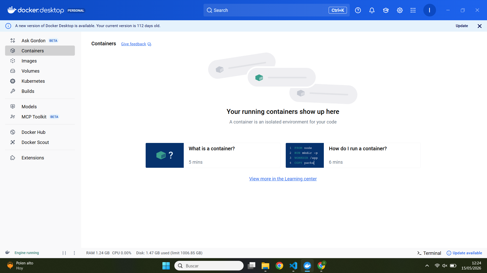

**Herramientas utilizadas con docker**:
- Docker Desktop
- Docker Compose
- Odoo container
- PostgreSQL container

Para comenzar, hemos creado un archivo docker-compose.yml con la siguiente configuración:

- Servicio Odoo (ERP)
- Servicio PostgreSQL (base de datos)
- Conexión entre ambos mediante red interna
- Puerto expuesto: 8069

Y para poder iniciar el sistema se utiliza el comando `docker compose up -d` y accedemos al sistema con `http://localhost:8069`

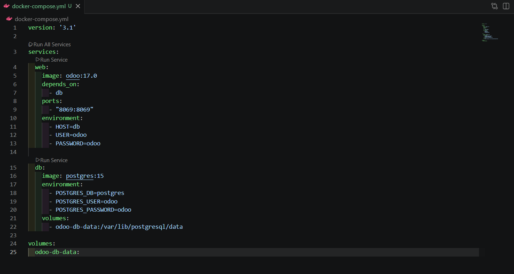

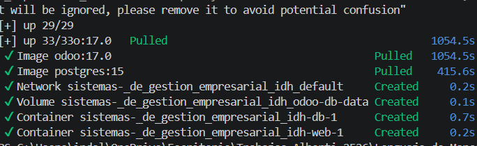

### 2.2 Odoo Server y PostgreSQL

El sistema funciona con dos componentes principales y ambos trabajan de forma conjunta para gestionar toda la información empresarial:

- Odoo Server → interfaz y lógica del ERP
    - Reación de base de datos
    - Configuración de usuario administrador
    - Acceso al panel principal
    - Uso de módulos (ventas, inventario, CRM…)
  
- PostgreSQL → almacenamiento de datos

Una vez desplegado Odoo mediante Docker, el siguiente paso es la creación de una base de datos, necesaria para almacenar toda la información del sistema.

Al acceder a la aplicación desde el navegador `http://localhost:8069`, Odoo muestra una pantalla inicial donde se solicita la creación de una nueva base de datos.

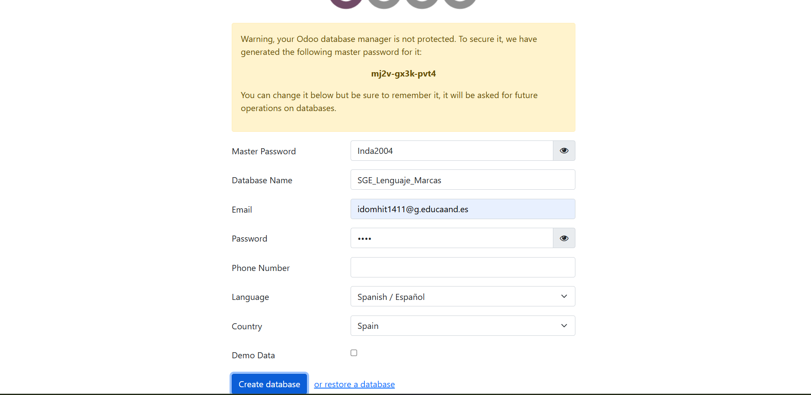

Ya para terminar, Odoo se conecta automáticamente con PostgreSQL y:
- Se crea la base de datos en el servidor
- Se inicializan las tablas necesarias
- Se cargan datos básicos del sistema
- Se accede al panel principal del ERP

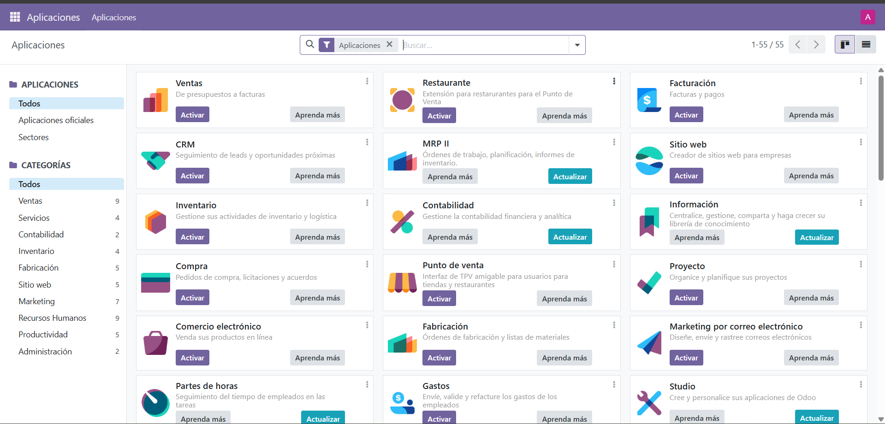

---

## 3. Administración y configuración.

La administración y configuración del sistema de Odoo permite adaptar el ERP a las necesidades específicas de una empresa, gestionando tanto los datos como el comportamiento del sistema.

En primer lugar, se han configurado los datos principales de la empresa desde el apartado de ajustes:

- Nombre de la empresa
- Dirección
- País
- Moneda
- Idioma

Esta configuración es esencial para adaptar el sistema al entorno real de trabajo y poder gestionar a los diferentes usuarios gracias a la creación de un nuevo usuario, asignación de correo electrónico y  configuración de contraseña.

Los usuarios son parte principal del mantenimiento del sistema y tienen asignados distintos niveles de acceso en función de su rol:

- Usuario Básico: Acceso limitado
- Usuario de ventas: Acceso a clientes y pedidos
- Administrados: Acceso completo

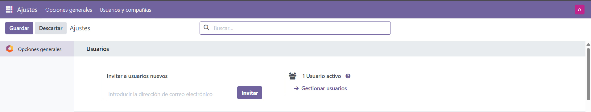

---

## 4. Integración de módulos

La integración de módulos en Odoo permite conectar diferentes áreas de la empresa en un único sistema, compartiendo información en tiempo real.

En este proyecto se ha realizado una integración práctica simulando el funcionamiento de un restaurante mediante el uso de varios módulos.

### Módulos utilizados

* Punto de Venta (POS)
* Ventas
* Inventario

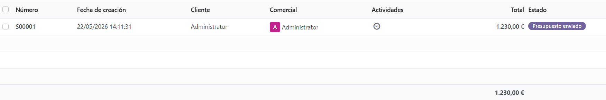

### Caso práctico

Se han creado productos que representan platos del restaurante, en nuestro caso de ejemplo, nuestro Kebab, configurándolo con su precio correspondiente.

Posteriormente, se ha utilizado el módulo de Punto de Venta para realizar ventas simuladas.

### Integración comprobada

Al realizar una venta:

* Se registra automáticamente en el sistema
* Se actualiza el inventario
* Se almacena el historial de ventas

Esto demuestra la correcta integración entre los módulos utilizados.

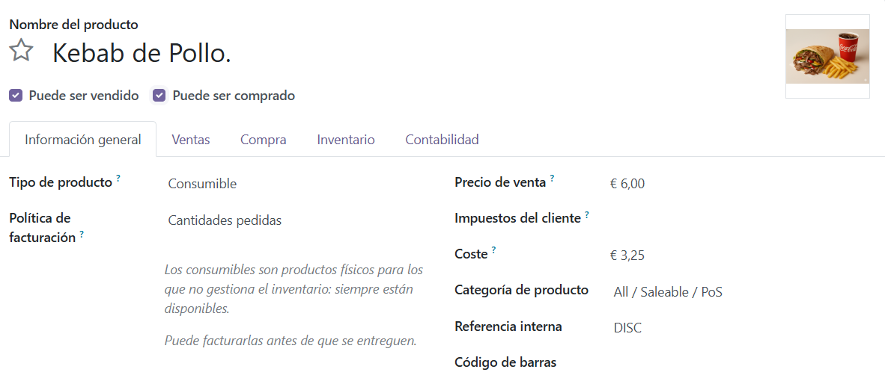

---

## 5. Mecanismos de acceso seguro. Roles y privilegios

Odoo dispone de un sistema de seguridad basado en usuarios y permisos.

### Gestión de usuarios

Se han creado distintos usuarios dentro del sistema para simular diferentes roles en la empresa.

### Roles configurados

* Administrador → acceso total
* Usuario de ventas → acceso limitado a ventas
* Usuario básico → acceso restringido

### Seguridad

Cada usuario tiene permisos específicos que limitan su acceso a la información y funcionalidades del sistema, garantizando la seguridad de los datos.

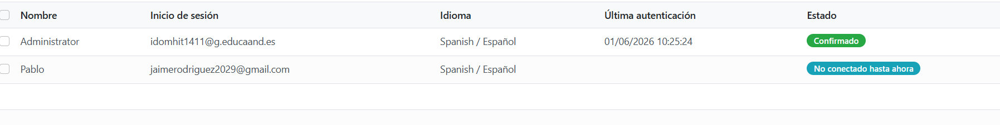

---

## 6. Elaboración de informes

Odoo permite generar informes automáticos a partir de los datos almacenados.

### Informes generados

* Informe de ventas
* Estadísticas de productos

### Utilidad

Estos informes permiten analizar la actividad del negocio y facilitar la toma de decisiones.

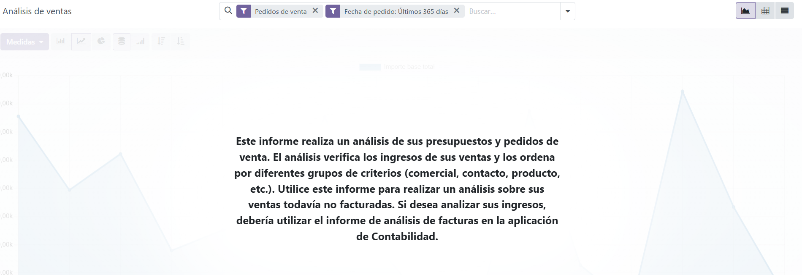

---

## 7. Exportación de información

El sistema permite exportar datos para su uso en otras herramientas.

### Acciones realizadas

* Exportación de productos
* Exportación de ventas

### Formatos utilizados

* CSV
* Excel

Esto facilita la integración con aplicaciones externas y el análisis de datos.

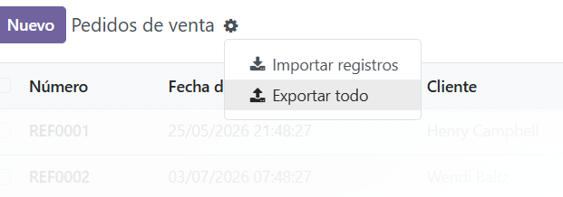

---

## 8. Elaboración de documentación

Se ha elaborado documentación detallada del proceso completo del proyecto.

### Contenido de la documentación

* Instalación de Odoo mediante Docker
* Configuración del sistema
* Creación de base de datos
* Gestión de productos
* Integración de módulos

### Objetivo

Permitir que cualquier usuario pueda reproducir el sistema siguiendo los pasos indicados.

---

## Conclusión

El uso de Odoo ha permitido simular un entorno empresarial real, aplicando conceptos de integración, seguridad, gestión de datos y análisis de información, cumpliendo con los objetivos del proyecto.

